# Integration Levelup Workshop
## Introduction
Contoso Commerce sells a variety of products from a variety of vendors.  Vendors send the catalog item updates via different methods and different formats.  Consoso receives these updates, converts them to a common catalog format, then submits the updates to the ecommerce system via a file drop.  The ecommerce system then processes the updates and makes them available to the website.

## Part 1a - Run the workflow locally
You are new to the team and need to get your local environment up and running.  This includes your local machine as well as your Azure environment.  You will run the process locally, use local storage emulation and run the workflow locally.  After running the workflow locally, you will provision the Azure resources needed to run the workflow in Azure, deploy the workflow, run the workflow in Azure and explor the telemetry captured by Application Insights.

### Step 1 - Setup your local environment
Before we get started, we need to setup you local development environment.  We need to create a local.settings.json file and a couple of containers in the local storage emulator.  First, we need to run Azurite, the local storage emulator.  Since we just installed the Azurite vscode extension, we are going to run it from vs Code.  

1. Open the command palette (ctrl+shift+p for windows, ctrl+option+p for mac) and type ```Azurite: Start```.  This will start the local storage emulator.  You should see a some notifications that Azurite is starting and then information in the visual studio code status bar.


2. Open a terminal window in vs code and navigate to the deployment directory.  Run the `.\setupforlocaldev.ps1 script.`  This script will create the local.settings.json file and create the containers needed for the workshop.

3. Verify your local.settings.json file, it should be in the root of the repo and should look as follows;


4. Verify the containers were created in the local storage emulator.  Click the Azure icon in the vs code activity bar, expand the workspace node, local emulator, and finally Blob Containers.  You should see an inbound and oubound container as shown below.


### Step 2 - Run the workflow locally
We should be good to run our logic app and do some local testing.  Click on the Run and Debug icon in the vs code activity bar.  Click the green arrow which will start the logic app.  You should see the following in the terminal window.


Now that the workflow is running, let's open the overview page.  Since the workflow is stateful, we can see previous runs and details about the running workflow similar to what we have when running in Azure.  Expand the `ingestCatalogItems` folder and right click on the `workflow.json` file and select `overview`.


This will open a new tab in vs code.


If the workflow had an http trigger, this is where you would find the URI to call the workflow. 

### Step 3 - Test the workflow
With everything running, let's drop a sample file in the `inbound` folder to test the workflow.  In the `sample-messages` folder you will find a sample xml file called `vendorsample.xml`.  This file needs to be uploaded to the `inbound` container.  YOu can do this through the Azure extension in vs code. 

 

 When prompted for a folder, hit enter to upload to the root of the container.  After the file has been uploaded, expand the outbound container and you should see a test.xml file which is our output file.  You should also see log activity in the terminal window.  Open the workflow overview if you closed it and you should see the run.

 

 If you click on the run, you can see the details.  You can see how the workflow executed and drill into details of each step.  All this is being stored in the local storage emulator.

 

## Part 1b - Run the workflow in Azure
Now that we have the workflow running locally, let's deploy it to Azure.  Each member of your new team has their own sandbox Azure subscription.  You will need to provision resources in your sandbox subscription and deploy the application to it.  The team has infrastructure as code scripts checked into the repository and setup scripts to make this process relatively painless.  Let's get started.

### Step 1 -  Provision Azure Resources
Open a terminal window and navigate to the infrastructure folder.  Execute `az deployment sub create -l eastus -f main.bicep` or `az deployment sub create -l eastus -f main.bicep --subscription <target subscriotion id>` to provision the resources.  This will take a few minutes to complete.  When it is done, there will be a new resource group in azure named `levelupIntegration-dev`.  The contents of the resource group should look like the following;


Copy your subscription id and the name of the key vault to a text file.  We will need these in the next step.

### Step 2 - Deploy the workflow
Now that we have the resources provisioned, we need to deploy the workflow.  Open a terminal window and navigate to the deployment folder.  Execute `.\appdeployment.ps1 -SubscriptionId "{SubscriptionId}" -ResourceGroupName "levelupIntegration-dev" -KeyVaultName "{KeyVaultName}"`.  This will deploy the workflow to the resource group we just created.  This may take a few minutes to complete.

When done, open the logic app in the azure portal and verify that the workflow has been deployed and that they application settings have been set.  You should see the following;


Note: we did deploy some of the resources necessary for the other scenarios to save time, hence the OpenAI resource and configuration.

### Step 3 - Test the workflow
Now that we have the workflow deployed, let's test it.  We will use the same sample file we used in the local test.  In the Azure portal, navigate to the genstorst<uniquestring> storage account, containers, inbound container and upload the vendorsample.xml file from the sample-messages folder.


You should see the file in the inbound container for a few seconds before it is picked up and then deleted by the workflow.  Once the file is gone, navigate to the outbound container and you should see the test.xml file.  This is the output of the workflow.

Go back to the logic app, workflows, and click on the ingestCatalogItems workflow.  Similar to the local development experience, you should see the run history and details of the run.  You can also see the telemetry in application insights.

## Part 2 - incorporate generative AI
The ecommerce department is interested in leveraging generative AI to create product descriptions.  The descriptions they receive from their vendors are not very good and at times only a short description.  They would like to leverage the product name, short description, and any specifications provided to create a more robust description.  You are being asked to enhance the existing catalog ingestion process to support the scenario.  You will need to create a new workflow that will call the OpenAI API to generate the description.  The workflow will need to call the OpenAI API, parse the response, and update the catalog item with the generated description.  The workflow will need to be called from the existing catalog ingestion workflow.

There will be two main parts to this scenario.  First, you will need to create the workflow that will call the OpenAI API.  Second, you will need to update the existing catalog ingestion workflow to call the new workflow.

### Part A: Create the OpenAI Workflow
In this section, we are going to build the following workflow, then test it with your favorite REST client.

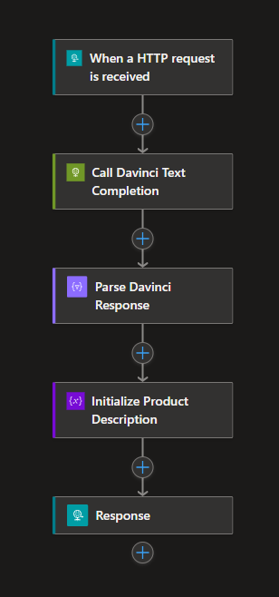

To help you get started, we did some pre work for you.  Fetch and checkout the branch named Part-2 Start.  We prebuilt some of the schemas and maps for you but you will still need to create the workflow and configure the actions.

#### Step 1 - Create an empty workflow
Using Ctrl+Shift+P, open the command window and select to create a new workflow.  Select stateful as the type of workflow and name the workflow `generateDescriptions`.  This will create a new folder named `generateDescriptions` with a workflow.json file in it.  The workflow.json file will also open showing you the JSON representation of the workflow.  You can close this file for now.

In the explorer, find the productDescriptionGenerator folder, right click on the workflow.json file and select designer to open the graphical designer.  When asked if you want to use Azure connectors, select skip.

Note: It will take a few moments to open the first time as it starts up some background services.

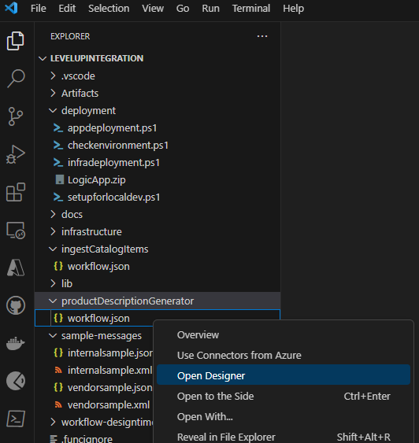

In a few moments, you should see a blank canvas with a simple 'Add a trigger' button.

### Step 2 - Wireup the initial Request Response flow
The workflow is fairlly simple, we need to setup a request trigger to receive a message via http, use that information to ocall OpenAI, parse the response from the openAI service, and return it as the response to our initial caller.

Click the 'Add a trigger' button in the middle of the canvas, search for and select When a HTTP request is received.


This will add the trigger to the canvas and open the trigger configuration.  We need to configure the trigger to accept a POST request and to accept a JSON payload.  copy the following json schema into the Request Body JSON Schema text box.

```json
{
    "type": "object",
    "properties": {
        "product-description": {
            "type": "string"
        }
    }
}
```

The Request parameters should look like the following;


Next, we want to make sure that we validate the schema and throw an error if the inbound message is invalid.  Click on the settings tab and check the schema validation option.

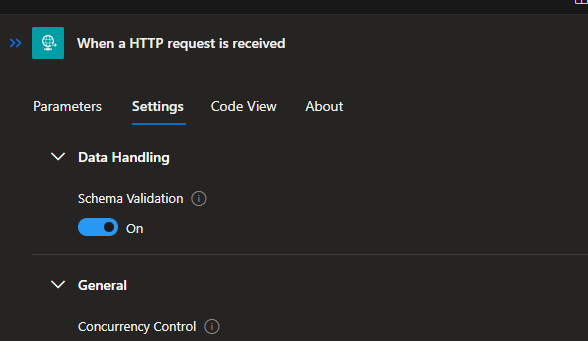

Next, let's add the response.  CLick on the plus under the Request trigger, search for response, and add it.  When done, your workflow should look similar to the following;

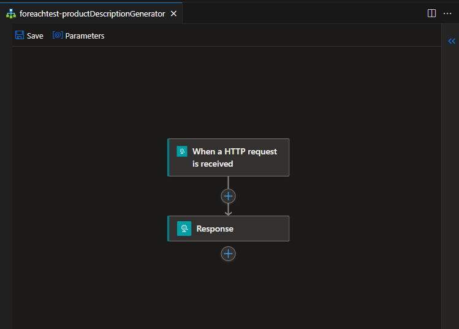

### Step 3 - Wireup the OpenAI call
Next, let's call our openai service.  Click the plus under the response action, search for http, and add the http action.  This will add the action to the canvas and open the configuration window.

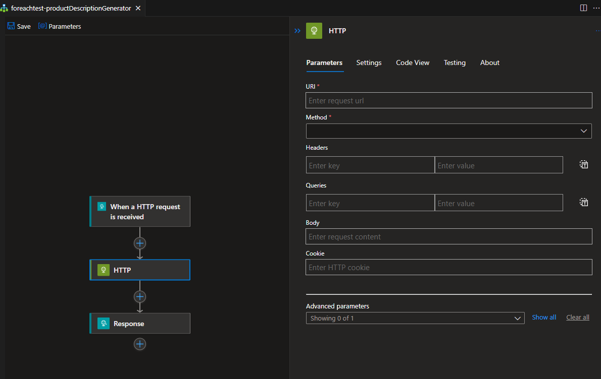

For HTTP actions, you don't configure a connection, you simply pass it a URL and configure the payload, headers, and/or query strings.  However, we want to make sure that the URL is parameterized so we can change it as we deploy across environments.  We also want to ensure that we don't store and API keys in our code.

To accomplish this, we are going to leverage parameters and our local.settings.json file.  At the top of the workflow, you see an option for parameters, click it to open the Parameters window.

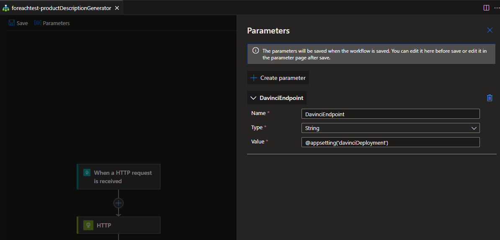

You need to create the 4 parameters listed in the table below;

| Name | Value | Description |
|------|-------|-------------|
|AOAIAPIKey |@appsetting('openaiKey') | The API key for the OpenAI service |
DavinciEndpoint |@appsetting('openaiEndpoint') | The endpoint for the OpenAI service |
| AzureAIBaseEndpoint | @appsetting('openaiEndpoint') | The base endpoint for the OpenAI service |
| AzureAPIVersion | @appsetting('azureOpenAIAPIVersion') | The version of the OpenAI API |

When done, your parameters window should look like the following;

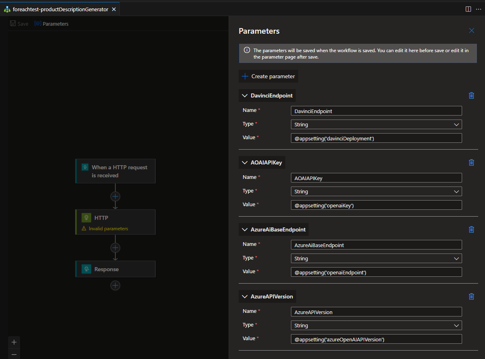

Click on the workflow canvas and then click on the HTTP Action.  Put your cursor in the URI text box.  You will see a blue icon pop, click on the blue lightining bolt.

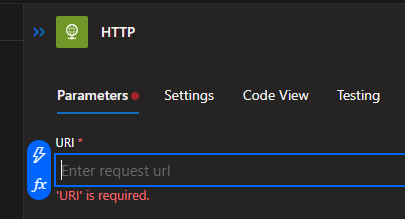

This will open a picker that lists all the values available from previous actions and parameters.  Select the AzureAIBaseENdpoint parameters, then click the blue lightning bolt again and pick the DavinciEndpoint parameter.  This will construct the URI from the parameters.  Next, select POST as the method.  For headers, type in `api-key` as your key and select the AOAIAPIKey parameter as the key value.  For queries, enter `api-version` as your key, then use the AzureAPIVersion parameter for the value.

Finally, for the body, we are going write some JSON and incorporate the part of the body we are receiving with the request.  Below is the JSON payload you need to add to the body with a placeholder for the request payload;

```
{
 "prompt": "You are generating descriptions for products to be sold online. Create a consice product description for: <product-description placeholder>",
 "max_tokens": 300,
 "n": 1
}

```

Since we are using a JSON Schema with the request, the values from the inbound JSON are available to us in the picker.  Highlight the placeholder text and click the blue lightning bolt.  Select the product-description property from the request body.  When done, your HTTP action should look like the following;

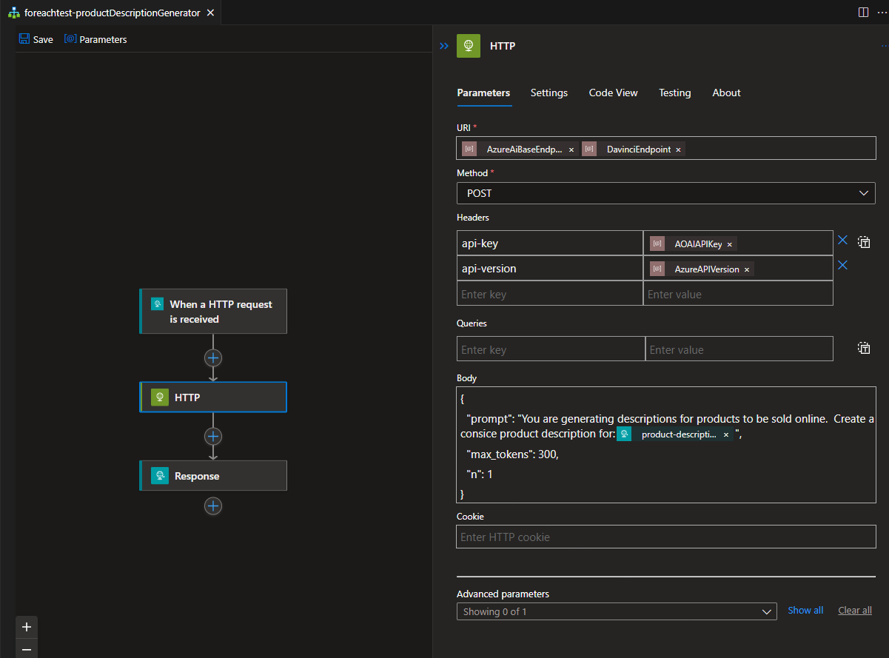

Almost done!  We need to add just two more actions between the HTTP and Response action.

First add a Parse JSON action.  This will parse the response from the OpenAI service.  Click the plus under the HTTP action, search for parse, and add the Parse JSON action.  This will add the action to the canvas and open the configuration window.  For the content, select the Body property from the HTTP action.  For the schema, copy the following JSON into the schema text box;

```json
{
    "type": "object",
    "properties": {
        "id": {
            "type": "string"
        },
        "object": {
            "type": "string"
        },
        "created": {
            "type": "integer"
        },
        "model": {
            "type": "string"
        },
        "prompt_annotations": {
            "type": "array",
            "items": {
                "type": "object",
                "properties": {
                    "prompt_index": {
                        "type": "integer"
                    },
                    "content_filter_results": {
                        "type": "object",
                        "properties": {
                            "hate": {
                                "type": "object",
                                "properties": {
                                    "filtered": {
                                        "type": "boolean"
                                    },
                                    "severity": {
                                        "type": "string"
                                    }
                                }
                            },
                            "self_harm": {
                                "type": "object",
                                "properties": {
                                    "filtered": {
                                        "type": "boolean"
                                    },
                                    "severity": {
                                        "type": "string"
                                    }
                                }
                            },
                            "sexual": {
                                "type": "object",
                                "properties": {
                                    "filtered": {
                                        "type": "boolean"
                                    },
                                    "severity": {
                                        "type": "string"
                                    }
                                }
                            },
                            "violence": {
                                "type": "object",
                                "properties": {
                                    "filtered": {
                                        "type": "boolean"
                                    },
                                    "severity": {
                                        "type": "string"
                                    }
                                }
                            }
                        }
                    }
                },
                "required": [
                    "prompt_index",
                    "content_filter_results"
                ]
            }
        },
        "choices": {
            "type": "array",
            "items": {
                "type": "object",
                "properties": {
                    "text": {
                        "type": "string"
                    },
                    "index": {
                        "type": "integer"
                    },
                    "finish_reason": {
                        "type": "string"
                    },
                    "logprobs": {},
                    "content_filter_results": {
                        "type": "object",
                        "properties": {
                            "hate": {
                                "type": "object",
                                "properties": {
                                    "filtered": {
                                        "type": "boolean"
                                    },
                                    "severity": {
                                        "type": "string"
                                    }
                                }
                            },
                            "self_harm": {
                                "type": "object",
                                "properties": {
                                    "filtered": {
                                        "type": "boolean"
                                    },
                                    "severity": {
                                        "type": "string"
                                    }
                                }
                            },
                            "sexual": {
                                "type": "object",
                                "properties": {
                                    "filtered": {
                                        "type": "boolean"
                                    },
                                    "severity": {
                                        "type": "string"
                                    }
                                }
                            },
                            "violence": {
                                "type": "object",
                                "properties": {
                                    "filtered": {
                                        "type": "boolean"
                                    },
                                    "severity": {
                                        "type": "string"
                                    }
                                }
                            }
                        }
                    }
                },
                "required": [
                    "text",
                    "index",
                    "finish_reason",
                    "logprobs",
                    "content_filter_results"
                ]
            }
        },
        "usage": {
            "type": "object",
            "properties": {
                "completion_tokens": {
                    "type": "integer"
                },
                "prompt_tokens": {
                    "type": "integer"
                },
                "total_tokens": {
                    "type": "integer"
                }
            }
        }
    }
}
```
This will make it easy for us to work with the response from the OpenAI service.

When done, your Parse JSON action should look like the following;

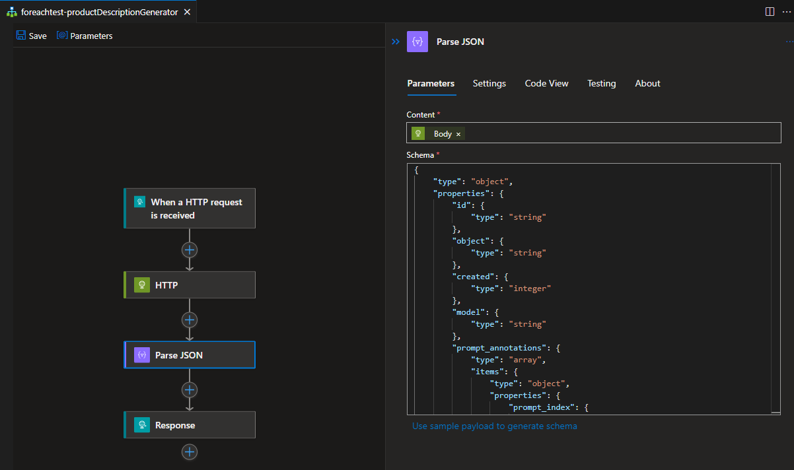

Next, we are going to initialize a variable and grab our generated description.  Turns out that what we want is in a JSON array, so we need a formula to grab exactly what we want.  Click the plus under the Parse JSON action, search for initialize, and add the Initialize variable action.  This will add the action to the canvas and open the configuration window.  For the name, enter `ProductDescription`.  For the value, put your cursor in the text box and click the blue fx button that pops up.  This will open the expression editor.  In the expression editor, enter the following expression and click the Add button to add the expression to the value text box.

```;
body('Parse_JSON')?['choices'][0]['text']
```

NOTE: since we are not picking from the pick list, the name of the action may be something other than 'Parse_JSON'.

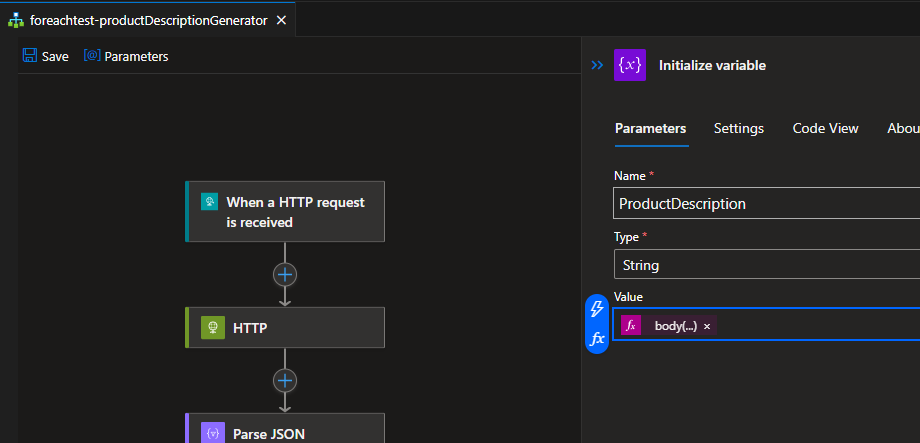

Lastly, let's send the response back to the caller.  Click on the response action and enter the following in the body text box;

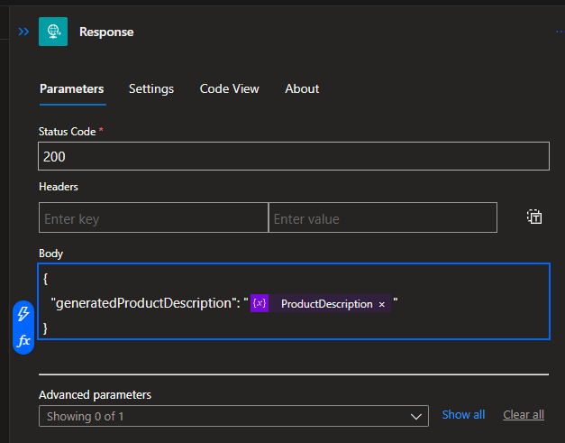

Finally, save your work.

Remember those parameters?  When you saved your workflow, since we have parameters, a new parameters.json file was created.  If you open it, you will see the following;

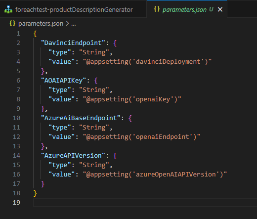

The @appsettings function will lookup the value in your app configuration when deployed to Azure, when running locally, it will pull the information from your local.settings.json file.  So we have a few entries to create, which will require us to provision a model in OpenAI.

### Step 4 - Provision an OpenAI model, update local settings, and test
Use the following Azure CLI command to provision a Davinci model in your OpenAI service.

```
az cognitiveservices account deployment create -g levelupIntegration-dev -n <yourservicename> --deployment-name davincimodel --model-name gpt-35-turbo-instruct --model-version "0914" --model-format OpenAI --sku-capacity 120 --sku-name "Standard"
```

Next, we need to get the endpoint and key for the service and a few additional parameter values for our local.settings.json file.  Turns out, we did some extra work when provisioning the infrastructure.  We provisioned an OpenAPI service for you, grabbed a few pieces of data, and stuffed them into keyvault.  Run the following three commands, with the name of your keyvault, to get the information you need;

```
az keyvault secret show --name openaiEndpoint --vault-name <yourkeyvault> --query "value"
az keyvault secret show --name openaiKey --vault-name <yourkeyvault> --query "value"
az keyvault secret show --name openaiName --vault-name <yourkeyvault> --query "value"
```

Next, we need to update your local settings json file with the values we just retrieved.  Open the local.settings.json file and update the following values;

```json
{
  "IsEncrypted": false,
  "Values": {
    "AzureWebJobsStorage": "UseDevelopmentStorage=true",
    "APP_KIND": "workflowapp",
    "ProjectDirectoryPath": "c:\\Source\\LevelUpIntegration",
    "FUNCTIONS_WORKER_RUNTIME": "node",
    "WORKFLOWS_SUBSCRIPTION_ID": "",
    "AzureBlob_connectionString": "DefaultEndpointsProtocol=http;AccountName=devstoreaccount1;AccountKey=Eby8vdM02xNOcqFlqUwJPLlmEtlCDXJ1OUzFT50uSRZ6IFsuFq2UVErCz4I6tq/K1SZFPTOtr/KBHBeksoGMGw==;BlobEndpoint=http://127.0.0.1:10000/devstoreaccount1;",
    "openaiEndpoint" : "<your value>",
    "openaiKey" : "<your value>",
    "openaiName":"<your value>",
    "davinciDeployment": "openai/deployments/davincimodel/completions",
    "azureOpenAIAPIVersion": "2023-06-01-preview"  
  }
}
```

You should be good to test your workflow.  Run / Debug the solution locally, then open the productDescriptionGenerator workflow overview to get the URI.  Use your favorite REST client to call the workflow.  The body of your post should be JSON and look like;

```json
{
  "product-description": "A baseball bat"
}
```

If successful, you should get a response that looks simlar to this;

```json
{
    "generatedProductDescription": "\n\n\"Experience the perfect swing with our high-quality, lightweight baseball bat. Crafted from durable materials for optimal performance, this bat will help take your game to the next level.\""
}
```


### Step 5 - Deploy to Azure and test
Before we can deploy and run the logicapp, we need to add some additional configuration to the service.  We need to add a few few missing app settings and we will use the Azure CLI to do this.  Run the following commands, with the name of your keyvault, to get the information you need;

```
az logicapp config appsettings set --name <YourLogicAppName> --resource-group levelupIntegration-dev --subscription <YourSubscriptionID> --settings "davinciDeployment=openai/deployments/davincimodel/completions"
az logicapp config appsettings set --name <YourLogicAppName> --resource-group levelupIntegration-dev --subscription <YourSubscriptionID> --settings "azureOpenAIAPIVersion=2023-06-01-preview"
```

Once done, navigate to the deployment folder and run the appdeployment.ps1 script the same way you ran it in part-1.  Once deployed, navigate to the logic app in the azure portal and grab the URI for the workflow so you can test it.  Use your favorite REST client to call the workflow.  The body of your post should be JSON and look like;

```json
{
  "product-description": "A baseball bat"
}
```

### Part B: Modify the ingestion workflow to call the OpenAI workflow
In this section we will be changing the origional ingestion workflow to call out to the OpenAI workflow we just created.  We will be using the workflow we created in part 1 as a starting point.  We will be adding a new action to the workflow to call the OpenAI workflow.  We will then update the batch to include the generated descriptions for each batch item.

#### Step 1 - Add the OpenAI workflow call
Open the designer for the `ingestCatalogItems` workflow.  We are going to make changes where the arrow is in the picture below.

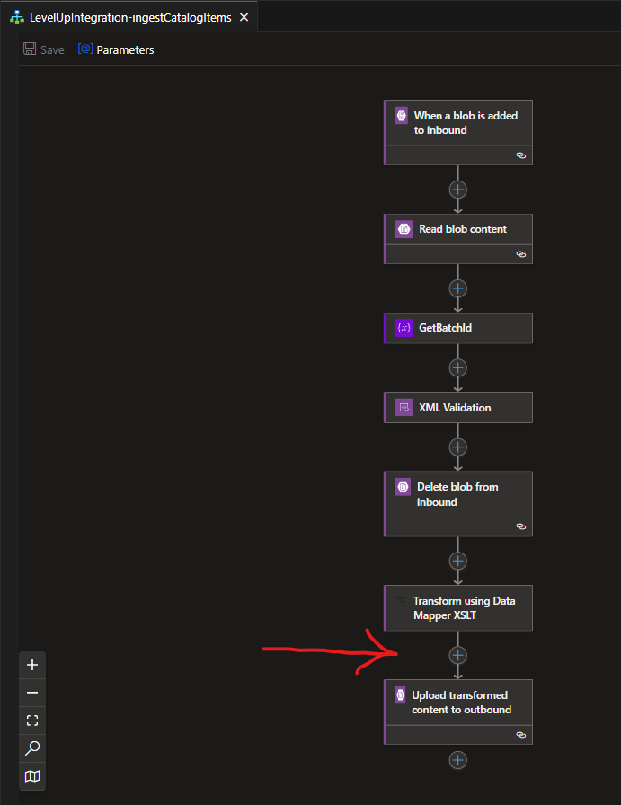

At a high level, here is what we are going to do.
- transform the internal batch from XML to JSON
- Setup a for each loop to iterate over the batch items
- for each batch item, we are going to invoke the generateDescriptions workflow we just created
- Update the batch item
- compose the final outbound batch
- Save the batch to blob storage

We took care of some of the grunt work for you and provided the necessary schemas and maps so you only have to wire up the workflow.

Under the Transform using data mapper xslt action, add another.  Transform action.

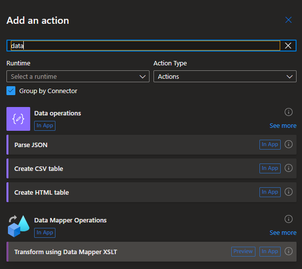

Once added, the properties dialog will open.  For content, select the output of the Transform action above the one you just added.  Leave the map source as LogicApp.  Pick internalXMLBatch-to-internalJSONBatch as your map.

Next, add a For Each action under the Transform action you just added.  Use the following expression as the output from previous step;

```
"@body('Transform_-_xml_batch_to_JSON_batch_msg')?['catalogItems']"
```

Note: the name of the action may be different than the one above.

Next, add a 'Invoke a workflow in this workflow app' action.  Select the product DescriptionGenerator as the workflow to call.  And using the blue FX button with your cursor in the body text box, search for and pick item() from the list of functions.  Add '.shortDesc' so the function looks like `item().shortDesc`.

The item() function is a reference to the current item in the for each loop.  This will pass the short description to the OpenAI workflow.

Now that we are generating descriptions from the batch, we need to update our outbound batch with the new long descriptions.  Under the Invoke workflow Action, add a compose action.  Put your cursor in the text box and click the blue fx button.  Enter the following expression;
```
setProperty(item(),'longDesc',body('Invoke_a_workflow_in_this_workflow_app').generatedProductDescription)
```
Make sure you click the add button to add the expression to the text box.

We are now updating each batch record with the new long description.  Next we need to assemble the records into our final, outbound batch.

Under the for each loop, add another compose action.  Configure the inputs as follows;

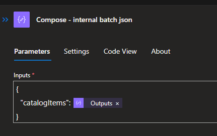

Lastly, click on the upload blob action and change the content value to be the output of the last compose action.  Your parameters should look similar to the following;

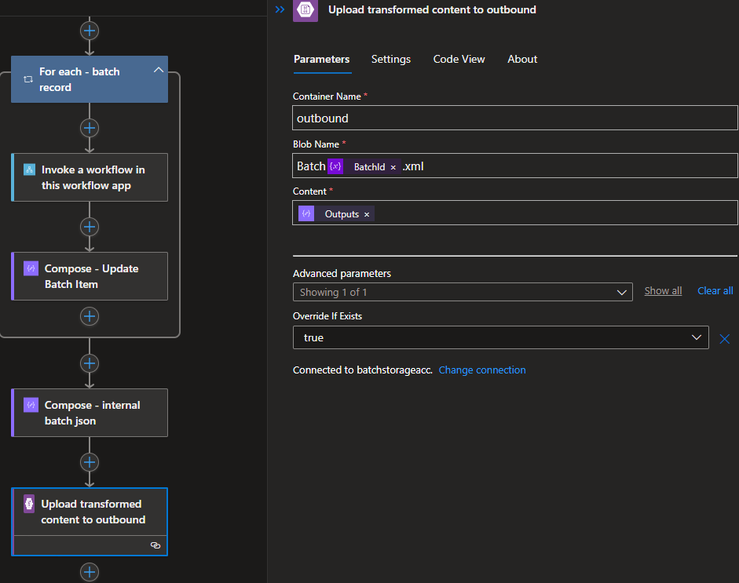

You should be good to run the solution.  Spin it up and drop the vendor xml file in your local input container the same as you did with part one.  When the workflow completes, take a look at the local output container to see your new batch with much better descriptions than it had previously.

Leaving the workflow running, open the overview and explore how the workflow executed.  Note how you can step through the loop to see the values sent to and from the generate description workflow.

Go ahead and deploy the updated workflow to Azure using the same script you used in part -1.  While we did some work to automatically add most of the app config necessary to run the app, you will need to add a configuration item for the model name.

## Summary
In this workshop, you learned how to create a logic app workflow, deploy it to Azure, and leverage the workflow designer to create a workflow that calls another workflow.  Work with parameters, local settings, run everything locally as well as in Azure, as well as how to leverage the Azure CLI to provision resources and configure your logic app.

Few things that we didn't specifically point that can be an advantage over simply coding it up;
- LogicApps are stateful.  You can see the state of the workflow, the inputs and outputs of each step, and the telemetry for each run.
- There is a many built in connectors that make it easy to integrate with other services as well as a rich set of actions that make it easy to work with data.
- The designer makes it easy to visualize the workflow and the data flowing through it.
- There is a visual mapper that helps you transform data from one format to another.
- We are actually tracking batch ID with Application insights making it easy to track a batch through the system.
- We are using the built in retry policy to retry failed steps.
- The for each loop is actually a for each parallel loop.  This means that each iteration of the loop is executed in parallel.  This is a great way to scale out your workflow.
- And more....