# Integration Levelup Workshop
## Introduction
Contoso Commerce sells a variety of products from a variety of vendors.  Vendors send the catalog item updates via different methods and different formats.  Consoso receives these updates, converts them to a common catalog format, then submits the updates to the ecommerce system via a file drop.  The ecommerce system then processes the updates and makes them available to the website.

## Part 1a - Run the workflow locally
You are new to the team and need to get your local environment up and running.  This includes your local machine as well as your Azure environment.  You will run the process locally, use local storage emulation and run the workflow locally.  After running the workflow locally, you will provision the Azure resources needed to run the workflow in Azure, deploy the workflow, run the workflow in Azure and explor the telemetry captured by Application Insights.

### Step 1 - Setup your local environment
Before we get started, we need to setup you local development environment.  We need to create a local.settings.json file and a couple of containers in the local storage emulator.  First, we need to run Azurite, the local storage emulator.  Since we just installed the Azurite vscode extension, we are going to run it from vs Code.  

1. Open the command palette (ctrl+shift+p for windows, ctrl+option+p for mac) and type ```Azurite: Start```.  This will start the local storage emulator.  You should see a some notifications that Azurite is starting and then information in the visual studio code status bar.

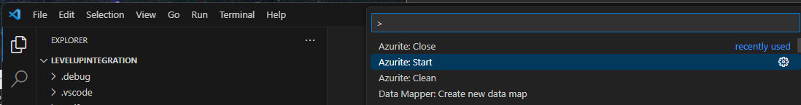

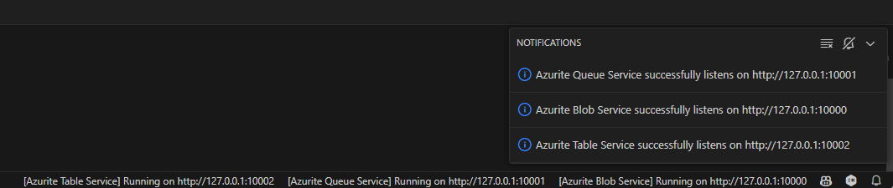


2. Open a terminal window in vs code and navigate to the deployment directory.  Run the `.\setupforlocaldev.ps1 script.`  This script will create the local.settings.json file and create the containers needed for the workshop.

3. Verify your local.settings.json file, it should be in the root of the repo and should look as follows;

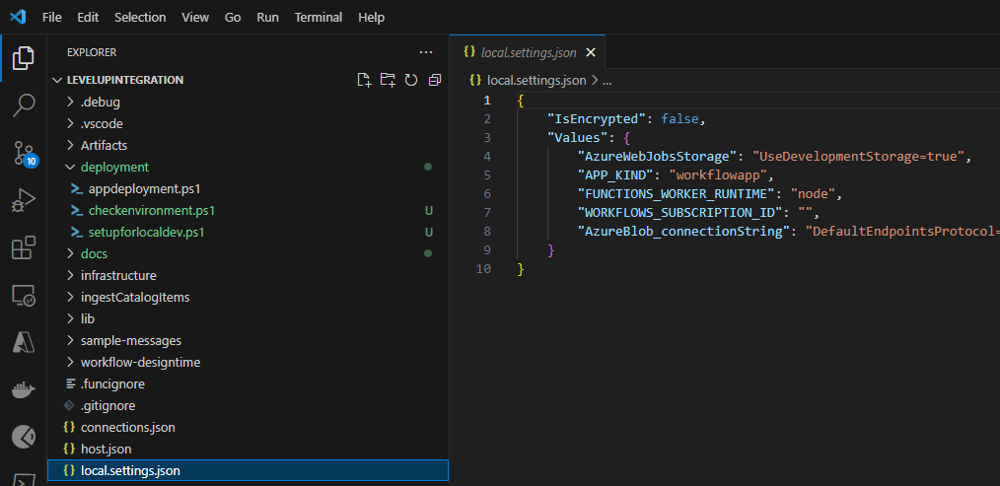

4. Verify the containers were created in the local storage emulator.  Click the Azure icon in the vs code activity bar, expand the workspace node, local emulator, and finally Blob Containers.  You should see an inbound and oubound container as shown below.

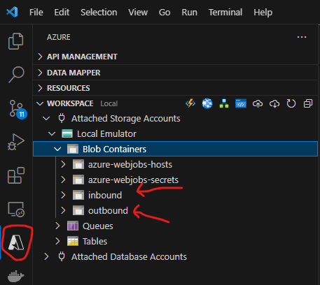


### Step 2 - Run the workflow locally
We should be good to run our logic app and do some local testing.  Click on the Run and Debug icon in the vs code activity bar.  Click the green arrow which will start the logic app.  You should see the following in the terminal window.

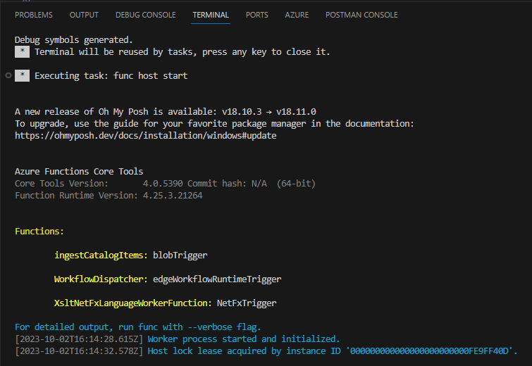

Now that the workflow is running, let's open the overview page.  Since the workflow is stateful, we can see previous runs and details about the running workflow similar to what we have when running in Azure.  Expand the `ingestCatalogItems` folder and right click on the `workflow.json` file and select `overview`.

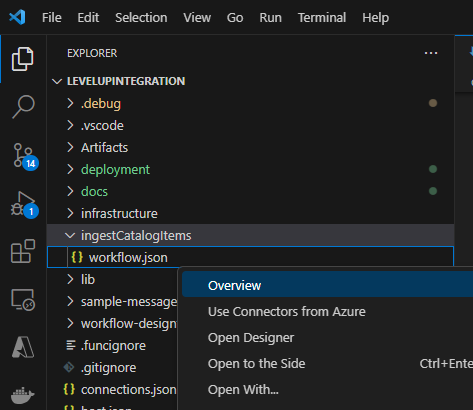

This will open a new tab in vs code.


If the workflow had an http trigger, this is where you would find the URI to call the workflow. 

### Step 3 - Test the workflow
With everything running, let's drop a sample file in the `inbound` folder to test the workflow.  In the `sample-messages` folder you will find a sample xml file called `vendorsample.xml`.  This file needs to be uploaded to the `inbound` container.  YOu can do this through the Azure extension in vs code. 

 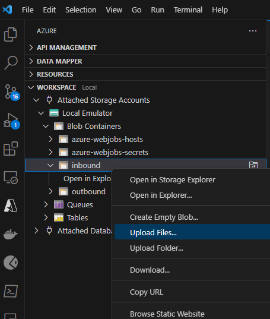

 When prompted for a folder, hit enter to upload to the root of the container.  After the file has been uploaded, expand the outbound container and you should see a test.xml file which is our output file.  You should also see log activity in the terminal window.  Open the workflow overview if you closed it and you should see the run.

 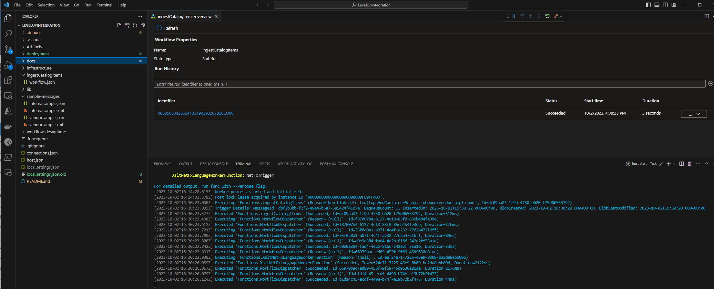

 If you click on the run, you can see the details.  You can see how the workflow executed and drill into details of each step.  All this is being stored in the local storage emulator.

 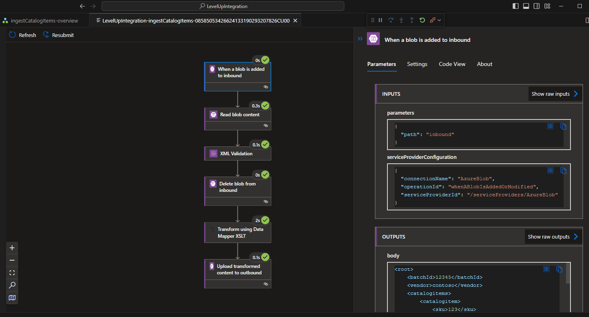

## Part 1b - Run the workflow in Azure
Now that we have the workflow running locally, let's deploy it to Azure.  Each member of your new team has their own sandbox Azure subscription.  You will need to provision resources in your sandbox subscription and deploy the application to it.  The team has infrastructure as code scripts checked into the repository and setup scripts to make this process relatively painless.  Let's get started.

### Step 1 -  Provision Azure Resources
Open a terminal window and navigate to the infrastructure folder.  Execute `az deployment sub create -l eastus -f main.bicep` or `az deployment sub create -l eastus -f main.bicep --subscription <target subscriotion id>` to provision the resources.  This will take a few minutes to complete.  When it is done, there will be a new resource group in azure named `levelupIntegration-dev`.  The contents of the resource group should look like the following;

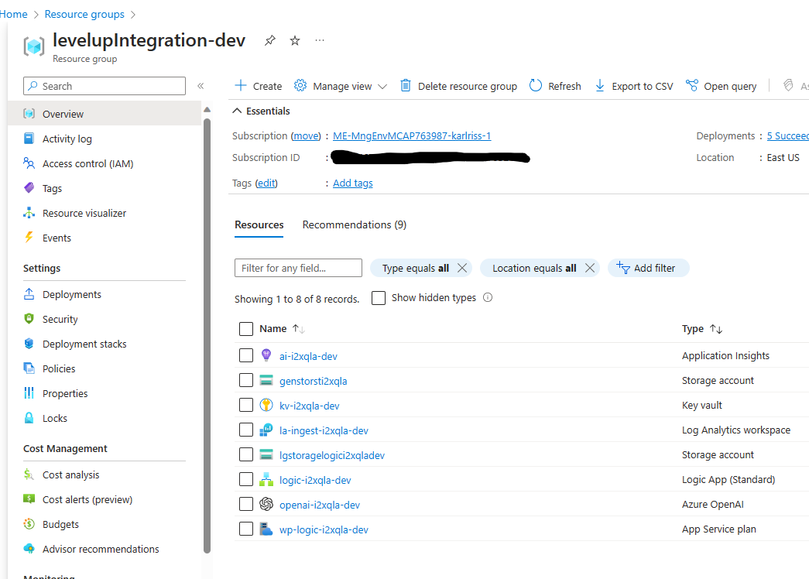

Copy your subscription id and the name of the key vault to a text file.  We will need these in the next step.

### Step 2 - Deploy the workflow
Now that we have the resources provisioned, we need to deploy the workflow.  Open a terminal window and navigate to the deployment folder.  Execute `.\appdeployment.ps1 -SubscriptionId "{SubscriptionId}" -ResourceGroupName "levelupIntegration-dev" -KeyVaultName "{KeyVaultName}"`.  This will deploy the workflow to the resource group we just created.  This may take a few minutes to complete.

When done, open the logic app in the azure portal and verify that the workflow has been deployed and that they application settings have been set.  You should see the following;

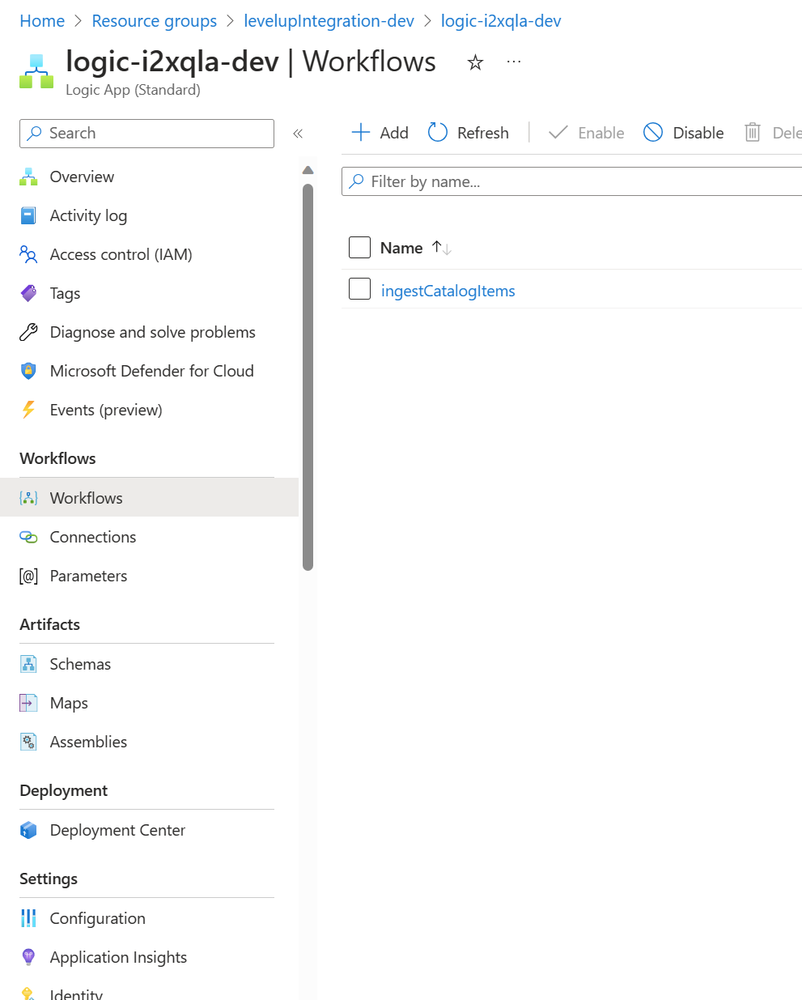

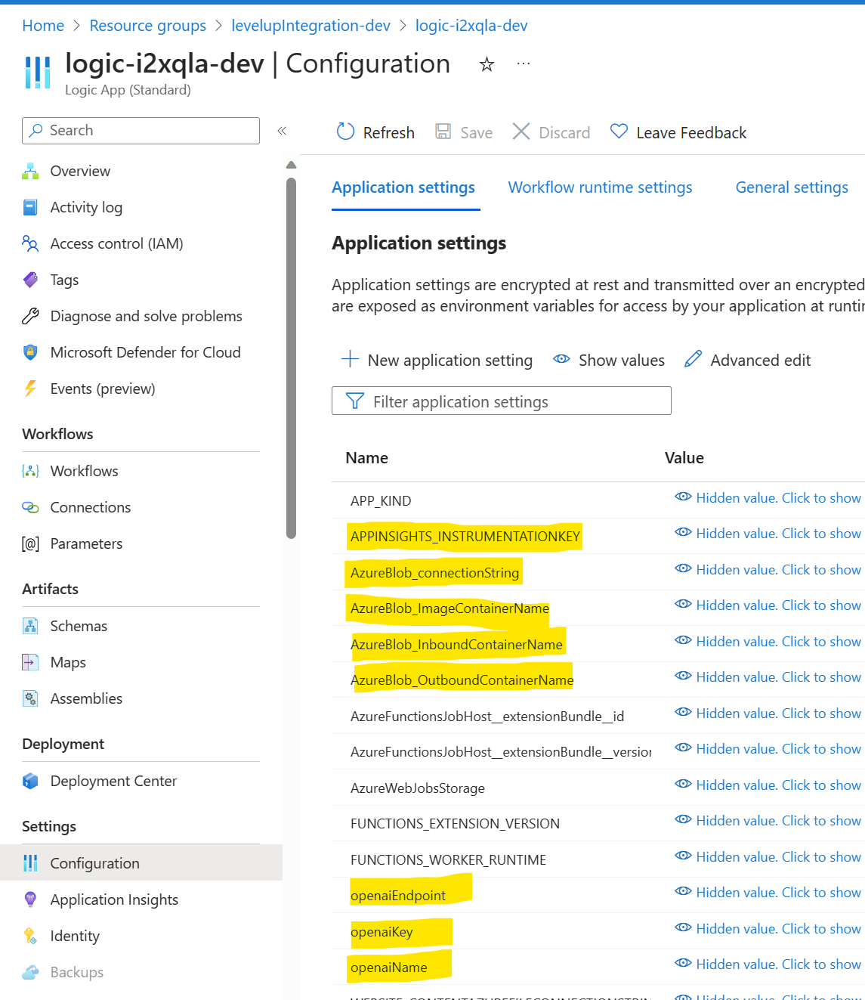


Note: we did deploy some of the resources necessary for the other scenarios to save time, hence the OpenAI resource and configuration.

### Step 3 - Test the workflow
Now that we have the workflow deployed, let's test it.  We will use the same sample file we used in the local test.  In the Azure portal, navigate to the genstorst<uniquestring> storage account, containers, inbound container and upload the vendorsample.xml file from the sample-messages folder.

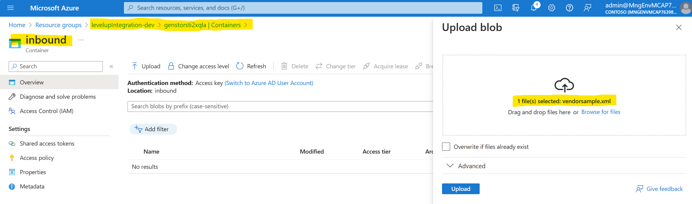

You should see the file in the inbound container for a few seconds before it is picked up and then deleted by the workflow.  Once the file is gone, navigate to the outbound container and you should see the test.xml file.  This is the output of the workflow.

Go back to the logic app, workflows, and click on the ingestCatalogItems workflow.  Similar to the local development experience, you should see the run history and details of the run.  You can also see the telemetry in application insights.

## Part 2 - incorporate generative AI
The ecommerce department is interested in leveraging generative AI to create product descriptions.  The descriptions they receive from their vendors are not very good and at times only a short description.  They would like to leverage the product name, short description, and any specifications provided to create a more robust description.  You are being asked to enhance the existing catalog ingestion process to support the scenario.


### Step 1 - Create the OpenAI Workflow


### Step 2 - Update the catalog ingestion workflow to call the OpenAI workflow

